# Breadboard: Stakk — 3D Tetris Game

## Workflow

**Operator perspective:** Usuario entra a stakk.vercel.app, juega una partida de Tetris 3D, obtiene un score, ingresa su nickname, y aparece en el ranking global.

---

## Places Table

| # | Place | Description |
|---|-------|-------------|
| P1 | Landing Page | Página inicial con nombre, "Click to play", preview ranking |
| P2 | Game (Playing) | Partida activa — controles habilitados, piezas cayendo |
| P3 | Game (Paused) | Partida pausada — juego oculto, timer de 2 min |
| P4 | Game Over | Pantalla final — score, posición, input nickname |
| P5 | Ranking View | Vista completa del ranking con filtros |
| P6 | Help Panel | Panel toggle con controles (overlay, no bloquea) |
| P7 | Backend | Vercel serverless + Supabase |

---

## UI Affordances Table

| # | Place | Component | Affordance | Control | Wires Out | Returns To |
|---|-------|-----------|------------|---------|-----------|------------|
| U1 | P1 | landing | "Stakk" title | render | — | — |
| U2 | P1 | landing | "Click to play" button | click | → N1 | — |
| U3 | P1 | landing | ranking preview (top 5) | render | — | — |
| U4 | P2 | game-ui | score display | render | — | — |
| U5 | P2 | game-ui | level display | render | — | — |
| U6 | P2 | game-ui | combo display | render | — | — |
| U7 | P2 | game-ui | next piece preview | render | — | — |
| U8 | P2 | game-ui | top 5 ranking sidebar | render | — | — |
| U9 | P2 | game-ui | "?" help button | click | → N2 | — |
| U10 | P2 | game-canvas | 3D grid (5x5x15) | render | — | — |
| U11 | P2 | game-canvas | current piece | render | — | — |
| U12 | P2 | game-canvas | placed blocks | render | — | — |
| U13 | P2 | game-canvas | grid floor lines | render | — | — |
| U14 | P2 | game-canvas | clear plane flash | render | — | — |
| U15 | P3 | pause-overlay | "Paused" message | render | — | — |
| U16 | P3 | pause-overlay | pause timer (2 min) | render | — | — |
| U17 | P3 | pause-overlay | "Continue" button | click | → N3 | — |
| U18 | P3 | pause-overlay | "Exit" button | click | → N4 | — |
| U19 | P4 | game-over | final score | render | — | — |
| U20 | P4 | game-over | ranking position | render | — | — |
| U21 | P4 | game-over | nickname input | type | → N5 | — |
| U22 | P4 | game-over | "Submit" button | click | → N6 | — |
| U23 | P4 | game-over | "Play again" button | click | → N7 | — |
| U24 | P4 | game-over | "View ranking" button | click | → N8 | — |
| U25 | P5 | ranking | full ranking list | render | — | — |
| U26 | P5 | ranking | "Global" filter tab | click | → N9 | — |
| U27 | P5 | ranking | "Daily" filter tab | click | → N10 | — |
| U28 | P5 | ranking | "Weekly" filter tab | click | → N11 | — |
| U29 | P5 | ranking | "Back to game" button | click | → N12 | — |
| U30 | P6 | help-panel | controls list | render | — | — |
| U31 | P6 | help-panel | close button | click | → N13 | — |
| U32 | P2 | audio-controls | preset selector | click | → N14 | — |

---

## Code Affordances Table

| # | Place | Component | Affordance | Control | Wires Out | Returns To |
|---|-------|-----------|------------|---------|-----------|------------|
| **Navigation** |
| N1 | P1 | landing | `startGame()` | call | → P2, → N20 | — |
| N2 | P2 | game-ui | `toggleHelp()` | call | → P6 | — |
| N3 | P3 | pause-overlay | `resumeGame()` | call | → P2, → N24 | — |
| N4 | P3 | pause-overlay | `exitGame()` | call | → P1 | — |
| N7 | P4 | game-over | `restartGame()` | call | → P2, → N20 | — |
| N8 | P4 | game-over | `viewRanking()` | call | → P5 | — |
| N12 | P5 | ranking | `backToLanding()` | call | → P1 | — |
| N13 | P6 | help-panel | `closeHelp()` | call | → P2 | — |
| **Game State** |
| N5 | P4 | game-over | `nicknameInput$` | write | store | → N6 |
| N6 | P4 | game-over | `submitScore()` | call | → N40, → N41 | — |
| N9 | P5 | ranking | `filterGlobal()` | call | → N42 | — |
| N10 | P5 | ranking | `filterDaily()` | call | → N42 | — |
| N11 | P5 | ranking | `filterWeekly()` | call | → N42 | — |
| N14 | P2 | audio-controls | `setAudioPreset()` | call | → S10 | — |
| **Game Loop** |
| N20 | P2 | game-engine | `initGame()` | call | → S1, → S2, → S3, → N21 | — |
| N21 | P2 | game-engine | `spawnPiece()` | call | → S4, → S5, → N30 | — |
| N22 | P2 | game-engine | `gameLoop()` | loop | → N23, → N25 | — |
| N23 | P2 | game-engine | `updatePiecePosition()` | call | → S4, → N30 | — |
| N24 | P2 | game-engine | `togglePause()` | call | → S6, → P3 | — |
| N25 | P2 | game-engine | `checkCollision()` | call | → N26 | → N23 |
| N26 | P2 | game-engine | `placePiece()` | call | → S7, → N27, → N21 | — |
| N27 | P2 | game-engine | `checkCompletePlanes()` | call | → N28 | → N26 |
| N28 | P2 | game-engine | `clearPlanes()` | call | → S7, → S2, → S8, → N29, → N30 | — |
| N29 | P2 | game-engine | `updateDifficulty()` | call | → S9 | — |
| N30 | P2 | three-renderer | `render()` | call | → U10, → U11, → U12, → U13, → U14 | — |
| **Input Handling** |
| N31 | P2 | input-handler | `onArrowKey()` | keydown | → N32 | — |
| N32 | P2 | game-engine | `movePiece(direction)` | call | → S4, → N25, → N30 | — |
| N33 | P2 | input-handler | `onRotateKey()` (Q/E/R/F) | keydown | → N34 | — |
| N34 | P2 | game-engine | `rotatePiece(axis)` | call | → S4, → N25, → N30 | — |
| N35 | P2 | input-handler | `onSpaceKey()` | keydown | → N36 | — |
| N36 | P2 | game-engine | `hardDrop()` | call | → S4, → N26 | — |
| N37 | P2 | input-handler | `onEscKey()` | keydown | → N24 | — |
| N38 | P2 | input-handler | `onMouseDrag()` | mousemove | → N39 | — |
| N39 | P2 | camera-controller | `rotateCamera()` | call | → S11, → N30 | — |
| N40 | P2 | input-handler | `onAxisKey()` (X/Y/Z) | keydown | → N41 | — |
| N41 | P2 | camera-controller | `snapCameraToAxis()` | call | → S11, → N30 | — |
| **Scoring** |
| N50 | P2 | scoring | `calculateDropScore()` | call | → S2 | → N26 |
| N51 | P2 | scoring | `calculateComboMultiplier()` | call | — | → N28 |
| N52 | P2 | scoring | `calculateMultiPlaneBonus()` | call | — | → N28 |
| N53 | P2 | scoring | `updateScore()` | call | → S2, → S8 | — |
| **Game Over** |
| N60 | P2 | game-engine | `checkGameOver()` | call | → N61 | → N21 |
| N61 | P2 | game-engine | `triggerGameOver()` | call | → S12, → P4 | — |
| **Backend API** |
| N70 | P7 | api/submit-score | `POST /api/submit-score` | call | → N71, → N72 | → N6 |
| N71 | P7 | api/submit-score | `validateScore()` | call | — | → N70 |
| N72 | P7 | supabase | `insertScore()` | call | → S20 | → N70 |
| N73 | P7 | api/rankings | `GET /api/rankings` | call | → N74 | → N42 |
| N74 | P7 | supabase | `queryRankings(filter)` | call | → S20 | → N73 |
| **Data Fetching** |
| N42 | P5 | ranking | `fetchRankings(filter)` | call | → N73 | → S13 |
| N43 | P1 | landing | `fetchTopRankings()` | call | → N73 | → S14 |
| N44 | P2 | game-ui | `fetchTopRankings()` | call | → N73 | → S15 |

---

## Data Stores Table

| # | Place | Store | Description |
|---|-------|-------|-------------|
| **Game State** |
| S1 | P2 | `grid[5][5][15]` | 3D array of placed blocks |
| S2 | P2 | `score` | Current score |
| S3 | P2 | `level` | Current level (based on planes cleared) |
| S4 | P2 | `currentPiece` | Active piece {type, position, rotation} |
| S5 | P2 | `nextPiece` | Preview of next piece |
| S6 | P2 | `isPaused` | Pause state boolean |
| S7 | P2 | `placedBlocks[]` | Array of block positions for rendering |
| S8 | P2 | `combo` | Consecutive plane clears |
| S9 | P2 | `fallSpeed` | Current piece fall speed (ms) |
| S10 | P2 | `audioPreset` | "all" / "effects" / "music" / "none" |
| S11 | P2 | `cameraRotation` | Camera angle {x, y} |
| S12 | P2 | `finalScore` | Score at game over |
| **Ranking** |
| S13 | P5 | `rankings[]` | Fetched ranking list |
| S14 | P1 | `topRankings[]` | Top 5 for landing preview |
| S15 | P2 | `topRankings[]` | Top 5 for in-game sidebar |
| **Backend** |
| S20 | P7 | `scores` table | Supabase: {id, nickname, score, created_at} |

---

## Mermaid Diagram

```mermaid
flowchart TB
    subgraph P1["P1: Landing Page"]
        U1["U1: 'Stakk' title"]
        U2["U2: Click to play"]
        U3["U3: ranking preview"]
        N43["N43: fetchTopRankings()"]
        S14["S14: topRankings[]"]
    end

    subgraph P2["P2: Game (Playing)"]
        subgraph gameUI["game-ui"]
            U4["U4: score display"]
            U5["U5: level display"]
            U6["U6: combo display"]
            U7["U7: next piece"]
            U8["U8: top 5 sidebar"]
            U9["U9: ? help button"]
            U32["U32: audio presets"]
        end

        subgraph gameCanvas["game-canvas (Three.js)"]
            U10["U10: 3D grid"]
            U11["U11: current piece"]
            U12["U12: placed blocks"]
            U13["U13: grid lines"]
            U14["U14: clear flash"]
        end

        subgraph gameEngine["game-engine"]
            N20["N20: initGame()"]
            N21["N21: spawnPiece()"]
            N22["N22: gameLoop()"]
            N23["N23: updatePiecePosition()"]
            N24["N24: togglePause()"]
            N25["N25: checkCollision()"]
            N26["N26: placePiece()"]
            N27["N27: checkCompletePlanes()"]
            N28["N28: clearPlanes()"]
            N29["N29: updateDifficulty()"]
            N60["N60: checkGameOver()"]
            N61["N61: triggerGameOver()"]
        end

        subgraph inputHandler["input-handler"]
            N31["N31: onArrowKey()"]
            N32["N32: movePiece()"]
            N33["N33: onRotateKey()"]
            N34["N34: rotatePiece()"]
            N35["N35: onSpaceKey()"]
            N36["N36: hardDrop()"]
            N37["N37: onEscKey()"]
            N38["N38: onMouseDrag()"]
            N40["N40: onAxisKey()"]
        end

        subgraph cameraController["camera-controller"]
            N39["N39: rotateCamera()"]
            N41["N41: snapCameraToAxis()"]
        end

        subgraph scoring["scoring"]
            N50["N50: calculateDropScore()"]
            N51["N51: calculateComboMultiplier()"]
            N52["N52: calculateMultiPlaneBonus()"]
            N53["N53: updateScore()"]
        end

        N30["N30: render()"]

        subgraph stores["Data Stores"]
            S1["S1: grid[5][5][15]"]
            S2["S2: score"]
            S3["S3: level"]
            S4["S4: currentPiece"]
            S5["S5: nextPiece"]
            S6["S6: isPaused"]
            S7["S7: placedBlocks[]"]
            S8["S8: combo"]
            S9["S9: fallSpeed"]
            S11["S11: cameraRotation"]
        end
    end

    subgraph P3["P3: Game (Paused)"]
        U15["U15: 'Paused' message"]
        U16["U16: pause timer"]
        U17["U17: Continue button"]
        U18["U18: Exit button"]
        N3["N3: resumeGame()"]
        N4["N4: exitGame()"]
    end

    subgraph P4["P4: Game Over"]
        U19["U19: final score"]
        U20["U20: ranking position"]
        U21["U21: nickname input"]
        U22["U22: Submit button"]
        U23["U23: Play again"]
        U24["U24: View ranking"]
        N5["N5: nicknameInput$"]
        N6["N6: submitScore()"]
        N7["N7: restartGame()"]
        N8["N8: viewRanking()"]
        S12["S12: finalScore"]
    end

    subgraph P5["P5: Ranking View"]
        U25["U25: ranking list"]
        U26["U26: Global tab"]
        U27["U27: Daily tab"]
        U28["U28: Weekly tab"]
        U29["U29: Back button"]
        N9["N9: filterGlobal()"]
        N10["N10: filterDaily()"]
        N11["N11: filterWeekly()"]
        N12["N12: backToLanding()"]
        N42["N42: fetchRankings()"]
        S13["S13: rankings[]"]
    end

    subgraph P6["P6: Help Panel"]
        U30["U30: controls list"]
        U31["U31: close button"]
        N13["N13: closeHelp()"]
        N2["N2: toggleHelp()"]
    end

    subgraph P7["P7: Backend"]
        N70["N70: POST /api/submit-score"]
        N71["N71: validateScore()"]
        N72["N72: insertScore()"]
        N73["N73: GET /api/rankings"]
        N74["N74: queryRankings()"]
        S20["S20: scores table"]
    end

    %% Landing → Game
    U2 --> N1["N1: startGame()"]
    N1 --> P2
    N1 --> N20
    N43 --> N73
    N73 -.-> S14
    S14 -.-> U3

    %% Game Loop
    N20 --> S1
    N20 --> S2
    N20 --> S3
    N20 --> N21
    N21 --> S4
    N21 --> S5
    N21 --> N30
    N22 --> N23
    N22 --> N25
    N23 --> S4
    N23 --> N30
    N25 -.-> N23
    N25 --> N26
    N26 --> S7
    N26 --> N27
    N26 --> N21
    N27 -.-> N26
    N27 --> N28
    N28 --> S7
    N28 --> S2
    N28 --> S8
    N28 --> N29
    N28 --> N30
    N29 --> S9

    %% Input → Game
    N31 --> N32
    N32 --> S4
    N32 --> N25
    N32 --> N30
    N33 --> N34
    N34 --> S4
    N34 --> N25
    N34 --> N30
    N35 --> N36
    N36 --> S4
    N36 --> N26
    N37 --> N24
    N24 --> S6
    N24 --> P3
    N38 --> N39
    N39 --> S11
    N39 --> N30
    N40 --> N41
    N41 --> S11
    N41 --> N30

    %% Scoring
    N50 -.-> N26
    N50 --> S2
    N51 -.-> N28
    N52 -.-> N28
    N53 --> S2
    N53 --> S8

    %% Render
    N30 --> U10
    N30 --> U11
    N30 --> U12
    N30 --> U13
    N30 --> U14
    S2 -.-> U4
    S3 -.-> U5
    S8 -.-> U6
    S5 -.-> U7

    %% Game Over
    N60 -.-> N21
    N60 --> N61
    N61 --> S12
    N61 --> P4
    S12 -.-> U19

    %% Pause
    U17 --> N3
    N3 --> P2
    N3 --> N24
    U18 --> N4
    N4 --> P1

    %% Game Over actions
    U21 --> N5
    U22 --> N6
    N5 -.-> N6
    N6 --> N70
    N70 --> N71
    N70 --> N72
    N72 --> S20
    N70 -.-> U20
    U23 --> N7
    N7 --> P2
    N7 --> N20
    U24 --> N8
    N8 --> P5

    %% Ranking
    U26 --> N9
    U27 --> N10
    U28 --> N11
    N9 --> N42
    N10 --> N42
    N11 --> N42
    N42 --> N73
    N73 --> N74
    N74 --> S20
    N74 -.-> N73
    N73 -.-> S13
    S13 -.-> U25
    U29 --> N12
    N12 --> P1

    %% Help
    U9 --> N2
    N2 --> P6
    U31 --> N13
    N13 --> P2

    classDef ui fill:#ffb6c1,stroke:#d87093,color:#000
    classDef nonui fill:#d3d3d3,stroke:#808080,color:#000
    classDef store fill:#e6e6fa,stroke:#9370db,color:#000
    classDef place fill:#fff,stroke:#333,stroke-width:2px

    class U1,U2,U3,U4,U5,U6,U7,U8,U9,U10,U11,U12,U13,U14,U15,U16,U17,U18,U19,U20,U21,U22,U23,U24,U25,U26,U27,U28,U29,U30,U31,U32 ui
    class N1,N2,N3,N4,N5,N6,N7,N8,N9,N10,N11,N12,N13,N14,N20,N21,N22,N23,N24,N25,N26,N27,N28,N29,N30,N31,N32,N33,N34,N35,N36,N37,N38,N39,N40,N41,N42,N43,N44,N50,N51,N52,N53,N60,N61,N70,N71,N72,N73,N74 nonui
    class S1,S2,S3,S4,S5,S6,S7,S8,S9,S10,S11,S12,S13,S14,S15,S20 store
```

---

## Slicing

| # | Slice | Mechanism | Affordances | Demo |
|---|-------|-----------|-------------|------|
| V1 | Core rendering | Grid + piece rendering | U10-U13, N30, S1, S4, S7, S11 | "3D grid visible, camera rotates" |
| V2 | Piece spawning | Generate & display pieces | U7, U11, N21, S4, S5 | "Piece appears at top, next piece shown" |
| V3 | Movement & rotation | Input handling | N31-N41, S4, S11 | "Arrows move piece, Q/E/R/F rotate, mouse rotates camera" |
| V4 | Collision & placement | Physics | N25, N26, S7, U12 | "Piece stops at bottom, stacks on others" |
| V5 | Plane clearing | Core mechanic | N27, N28, U14 | "Complete plane flashes and clears" |
| V6 | Scoring & difficulty | Progression | U4-U6, N50-N53, N29, S2, S3, S8, S9 | "Score increases, game speeds up" |
| V7 | Game over & UI flow | State management | U15-U24, N24, N60, N61, P3, P4 | "Game ends, can pause, restart" |
| V8 | Ranking system | Backend integration | U3, U8, U20, U25-U28, N6, N42, N70-N74, S13, S14, S20 | "Scores persist, rankings filter" |
| V9 | Polish | Landing + help | U1, U2, U9, U30-U32, P1, P6 | "Full user journey complete" |

---

## Slice Details

### V1: Core Rendering
**Demo:** "3D grid visible with isometric view, camera rotates with mouse drag and X/Y/Z snaps"

| # | Component | Affordance | Control | Wires Out |
|---|-----------|------------|---------|-----------|
| U10 | game-canvas | 3D grid (5x5x15) | render | — |
| U13 | game-canvas | grid floor lines | render | — |
| N30 | three-renderer | `render()` | call | → U10, U13 |
| N38 | input-handler | `onMouseDrag()` | mousemove | → N39 |
| N39 | camera-controller | `rotateCamera()` | call | → S11, → N30 |
| N40 | input-handler | `onAxisKey()` | keydown | → N41 |
| N41 | camera-controller | `snapCameraToAxis()` | call | → S11, → N30 |
| S11 | — | `cameraRotation` | store | — |

### V2: Piece Spawning
**Demo:** "Tetromino appears at top of grid, next piece preview shows upcoming shape"

| # | Component | Affordance | Control | Wires Out |
|---|-----------|------------|---------|-----------|
| U7 | game-ui | next piece preview | render | — |
| U11 | game-canvas | current piece | render | — |
| N20 | game-engine | `initGame()` | call | → S1, → N21 |
| N21 | game-engine | `spawnPiece()` | call | → S4, → S5, → N30 |
| S4 | — | `currentPiece` | store | — |
| S5 | — | `nextPiece` | store | — |

### V3: Movement & Rotation
**Demo:** "Arrow keys move piece on X/Z plane, Q/E rotates horizontal, R/F rotates vertical, space drops"

| # | Component | Affordance | Control | Wires Out |
|---|-----------|------------|---------|-----------|
| N31 | input-handler | `onArrowKey()` | keydown | → N32 |
| N32 | game-engine | `movePiece(direction)` | call | → S4, → N30 |
| N33 | input-handler | `onRotateKey()` | keydown | → N34 |
| N34 | game-engine | `rotatePiece(axis)` | call | → S4, → N30 |
| N35 | input-handler | `onSpaceKey()` | keydown | → N36 |
| N36 | game-engine | `hardDrop()` | call | → S4, → N26 |

### V4: Collision & Placement
**Demo:** "Piece stops when hitting floor or other blocks, placed blocks remain visible"

| # | Component | Affordance | Control | Wires Out |
|---|-----------|------------|---------|-----------|
| U12 | game-canvas | placed blocks | render | — |
| N22 | game-engine | `gameLoop()` | loop | → N23, → N25 |
| N23 | game-engine | `updatePiecePosition()` | call | → S4 |
| N25 | game-engine | `checkCollision()` | call | → N26 |
| N26 | game-engine | `placePiece()` | call | → S7, → N27, → N21 |
| S7 | — | `placedBlocks[]` | store | — |

### V5: Plane Clearing
**Demo:** "Complete a horizontal 5x5 plane, flash effect plays, plane disappears"

| # | Component | Affordance | Control | Wires Out |
|---|-----------|------------|---------|-----------|
| U14 | game-canvas | clear plane flash | render | — |
| N27 | game-engine | `checkCompletePlanes()` | call | → N28 |
| N28 | game-engine | `clearPlanes()` | call | → S7, → S2, → S8, → N30 |

### V6: Scoring & Difficulty
**Demo:** "Score increases based on drop height, combos multiply, game speeds up with levels"

| # | Component | Affordance | Control | Wires Out |
|---|-----------|------------|---------|-----------|
| U4 | game-ui | score display | render | — |
| U5 | game-ui | level display | render | — |
| U6 | game-ui | combo display | render | — |
| N29 | game-engine | `updateDifficulty()` | call | → S9 |
| N50 | scoring | `calculateDropScore()` | call | → S2 |
| N51 | scoring | `calculateComboMultiplier()` | call | — |
| N52 | scoring | `calculateMultiPlaneBonus()` | call | — |
| N53 | scoring | `updateScore()` | call | → S2, → S8 |
| S2 | — | `score` | store | — |
| S3 | — | `level` | store | — |
| S8 | — | `combo` | store | — |
| S9 | — | `fallSpeed` | store | — |

### V7: Game Over & UI Flow
**Demo:** "Blocks reach top = game over screen, ESC pauses with hidden game, timer warns at 2 min"

| # | Component | Affordance | Control | Wires Out |
|---|-----------|------------|---------|-----------|
| U15-U18 | pause-overlay | Pause UI elements | render/click | → N3, N4 |
| U19-U24 | game-over | Game over UI elements | render/click/type | → N5-N8 |
| N24 | game-engine | `togglePause()` | call | → S6, → P3 |
| N37 | input-handler | `onEscKey()` | keydown | → N24 |
| N60 | game-engine | `checkGameOver()` | call | → N61 |
| N61 | game-engine | `triggerGameOver()` | call | → S12, → P4 |
| S6 | — | `isPaused` | store | — |
| S12 | — | `finalScore` | store | — |

### V8: Ranking System
**Demo:** "Submit score with nickname, appears in global ranking, filter by daily/weekly"

| # | Component | Affordance | Control | Wires Out |
|---|-----------|------------|---------|-----------|
| U3 | landing | ranking preview | render | — |
| U8 | game-ui | top 5 sidebar | render | — |
| U20 | game-over | ranking position | render | — |
| U25-U28 | ranking | Ranking UI | render/click | → N9-N11 |
| N6 | game-over | `submitScore()` | call | → N70 |
| N42 | ranking | `fetchRankings()` | call | → N73 |
| N70-N74 | backend | API endpoints | call | → S20 |
| S13-S15 | — | ranking stores | store | — |
| S20 | supabase | `scores` table | store | — |

### V9: Polish
**Demo:** "Complete journey: landing → play → game over → ranking → play again"

| # | Component | Affordance | Control | Wires Out |
|---|-----------|------------|---------|-----------|
| U1 | landing | "Stakk" title | render | — |
| U2 | landing | "Click to play" | click | → N1 |
| U9 | game-ui | "?" help button | click | → N2 |
| U30-U31 | help-panel | Controls & close | render/click | → N13 |
| U32 | audio-controls | preset selector | click | → N14 |
| N1 | landing | `startGame()` | call | → P2 |
| N2 | game-ui | `toggleHelp()` | call | → P6 |
| N13 | help-panel | `closeHelp()` | call | → P2 |
